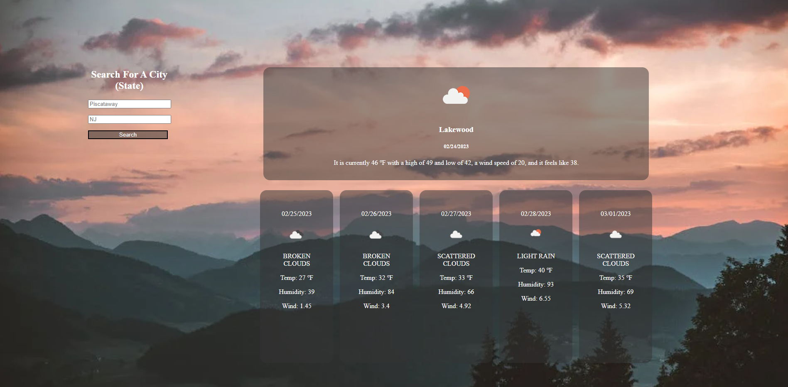

# Rutgers-Module6 (Weather Application)

# Task 
For this assignment, we were tasked with writing a weather app.

This project should have the following features

- The user can make a request by providing a city or city and state
- Display weather information on the current day plus the next five days
- Keep a History of the users' previous searches
  
## Additionally

Host this on GitHub Pages and include a screenshot in this README file as well.

Here is a link to this page: [GitHub Pages Project Link](https://tneiman19.github.io/Rutgers-Module6/)

